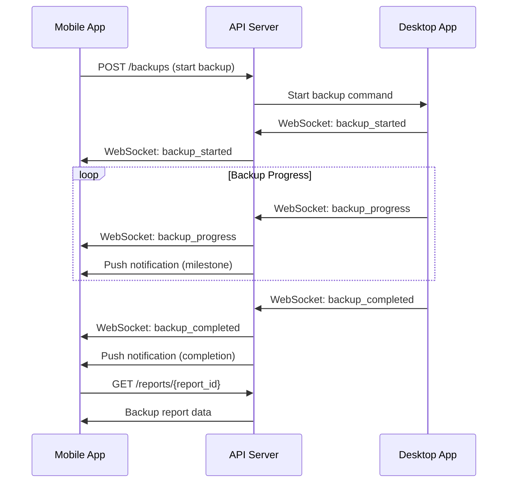
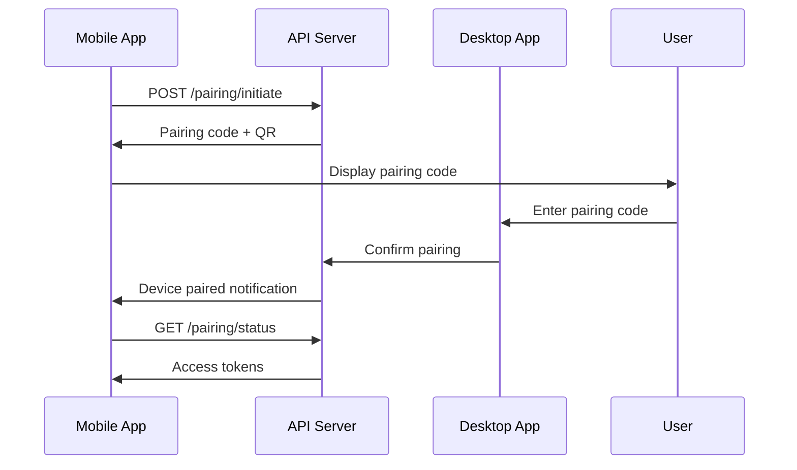

# NovaPcSuite Companion API Specification

This document defines the API specification for companion mobile applications that integrate with NovaPcSuite for remote monitoring, control, and notifications.

## Table of Contents

1. [Overview](#overview)
2. [Authentication](#authentication)
3. [Device Pairing](#device-pairing)
4. [WebSocket Events](#websocket-events)
5. [REST API Endpoints](#rest-api-endpoints)
6. [Telephony Integration](#telephony-integration)
7. [Push Notifications](#push-notifications)
8. [Security Model](#security-model)
9. [Example Flows](#example-flows)
10. [SDK Documentation](#sdk-documentation)

## Overview

The Companion API enables mobile applications to:

- **Monitor**: Real-time backup progress and system status
- **Control**: Trigger backups and manage schedules remotely
- **Notify**: Receive push notifications for backup events
- **Manage**: Configure backup settings and view reports

### Architecture

```
[Mobile App] ←→ [NovaPcSuite API Server] ←→ [Backup Engine]
     ↑                     ↑                       ↑
     └─ Push Notifications  └─ WebSocket Events     └─ File System
```

### Base URL

```
Production:  https://api.novapcsuite.com/v1
Development: http://localhost:8080/v1
```

## Authentication

### Device Registration

```http
POST /auth/register
Content-Type: application/json

{
  "device_name": "John's iPhone",
  "device_type": "mobile",
  "platform": "ios",
  "push_token": "fcm_token_or_apns_token",
  "public_key": "ed25519_public_key_base64"
}
```

**Response:**
```json
{
  "device_id": "dev_abc123",
  "pairing_code": "NOVA-1234-5678",
  "expires_at": "2024-01-15T11:00:00Z",
  "status": "pending_confirmation"
}
```

### Authentication Flow

1. **Register Device**: Mobile app generates keypair and registers
2. **Pairing Code**: Display 12-character pairing code to user
3. **Desktop Confirmation**: User enters code on desktop application
4. **Token Exchange**: Exchange pairing code for JWT tokens

### JWT Token Structure

```json
{
  "iss": "novapcsuite",
  "sub": "dev_abc123",
  "aud": "companion-api",
  "exp": 1642252800,
  "iat": 1642166400,
  "scope": ["backup.read", "backup.write", "notifications.receive"]
}
```

### Token Refresh

```http
POST /auth/refresh
Authorization: Bearer <refresh_token>

{
  "refresh_token": "refresh_token_here"
}
```

## Device Pairing

### Pairing Process

#### Step 1: Mobile App Registration

```http
POST /pairing/initiate
Content-Type: application/json

{
  "device_info": {
    "name": "John's iPhone",
    "type": "mobile",
    "platform": "ios",
    "version": "17.2",
    "app_version": "1.0.0"
  },
  "public_key": "ed25519_public_key_base64",
  "capabilities": ["push_notifications", "remote_backup", "file_preview"]
}
```

**Response:**
```json
{
  "pairing_id": "pair_xyz789",
  "pairing_code": "NOVA-1234-5678",
  "qr_code_data": "nova://pair?code=NOVA-1234-5678&id=pair_xyz789",
  "expires_at": "2024-01-15T11:00:00Z"
}
```

#### Step 2: Desktop Confirmation

User enters pairing code on desktop:

```bash
nova-pc-suite devices pair NOVA-1234-5678
```

#### Step 3: Pairing Completion

```http
GET /pairing/{pairing_id}/status
Authorization: Bearer <pairing_token>
```

**Response:**
```json
{
  "status": "confirmed",
  "device_id": "dev_abc123",
  "access_token": "jwt_access_token",
  "refresh_token": "jwt_refresh_token",
  "desktop_info": {
    "hostname": "john-desktop",
    "platform": "linux",
    "version": "0.1.0"
  }
}
```

### Device Management

#### List Paired Devices

```http
GET /devices
Authorization: Bearer <access_token>
```

**Response:**
```json
{
  "devices": [
    {
      "device_id": "dev_abc123",
      "name": "John's iPhone",
      "type": "mobile",
      "platform": "ios",
      "last_seen": "2024-01-15T10:30:00Z",
      "status": "online",
      "capabilities": ["push_notifications", "remote_backup"]
    }
  ]
}
```

#### Unpair Device

```http
DELETE /devices/{device_id}
Authorization: Bearer <access_token>
```

## WebSocket Events

### Connection

```javascript
const ws = new WebSocket('wss://api.novapcsuite.com/v1/ws');
ws.onopen = () => {
  ws.send(JSON.stringify({
    type: 'authenticate',
    token: 'jwt_access_token'
  }));
};
```

### Event Types

#### Backup Events

```json
{
  "type": "backup_started",
  "data": {
    "backup_id": "backup_456",
    "source_path": "/home/user/documents",
    "label": "documents-backup",
    "estimated_size": 1073741824,
    "started_at": "2024-01-15T10:00:00Z"
  }
}
```

```json
{
  "type": "backup_progress",
  "data": {
    "backup_id": "backup_456",
    "files_processed": 150,
    "total_files": 300,
    "bytes_processed": 536870912,
    "total_bytes": 1073741824,
    "current_file": "/home/user/documents/project/large_file.pdf",
    "chunks_created": 45,
    "chunks_deduplicated": 12,
    "progress_percent": 50.0
  }
}
```

```json
{
  "type": "backup_completed",
  "data": {
    "backup_id": "backup_456",
    "manifest_id": "manifest_789",
    "files_processed": 300,
    "total_size": 1073741824,
    "chunks_created": 256,
    "deduplication_ratio": 0.15,
    "duration_seconds": 120,
    "completed_at": "2024-01-15T10:02:00Z"
  }
}
```

#### System Events

```json
{
  "type": "system_status",
  "data": {
    "cpu_usage": 15.5,
    "memory_usage": 42.3,
    "disk_usage": 78.9,
    "backup_service_status": "running",
    "last_backup": "2024-01-15T08:00:00Z"
  }
}
```

#### Error Events

```json
{
  "type": "backup_error",
  "data": {
    "backup_id": "backup_456",
    "error_code": "INSUFFICIENT_DISK_SPACE",
    "error_message": "Not enough disk space for backup",
    "file_path": "/home/user/documents/large_file.iso",
    "retry_possible": false
  }
}
```

### Client Commands

#### Trigger Backup

```json
{
  "type": "start_backup",
  "data": {
    "source_path": "/home/user/documents",
    "label": "manual-backup-from-mobile",
    "options": {
      "generate_report": true,
      "compression_level": "normal"
    }
  }
}
```

#### Request Status

```json
{
  "type": "get_status",
  "data": {
    "include_active_backups": true,
    "include_system_info": true
  }
}
```

## REST API Endpoints

### Backup Management

#### List Backups

```http
GET /backups
Authorization: Bearer <access_token>
```

**Query Parameters:**
- `limit`: Number of results (default: 50, max: 100)
- `offset`: Pagination offset
- `status`: Filter by status (`running`, `completed`, `failed`)
- `since`: ISO 8601 timestamp for filtering

**Response:**
```json
{
  "backups": [
    {
      "backup_id": "backup_456",
      "manifest_id": "manifest_789",
      "label": "documents-backup",
      "source_path": "/home/user/documents",
      "status": "completed",
      "created_at": "2024-01-15T10:00:00Z",
      "completed_at": "2024-01-15T10:02:00Z",
      "file_count": 300,
      "total_size": 1073741824,
      "compressed_size": 917504000
    }
  ],
  "pagination": {
    "total": 25,
    "limit": 50,
    "offset": 0,
    "has_more": false
  }
}
```

#### Get Backup Details

```http
GET /backups/{backup_id}
Authorization: Bearer <access_token>
```

**Response:**
```json
{
  "backup_id": "backup_456",
  "manifest_id": "manifest_789",
  "label": "documents-backup",
  "source_path": "/home/user/documents",
  "status": "completed",
  "progress": {
    "files_processed": 300,
    "total_files": 300,
    "bytes_processed": 1073741824,
    "total_bytes": 1073741824,
    "progress_percent": 100.0
  },
  "metrics": {
    "duration_seconds": 120,
    "chunks_created": 256,
    "chunks_deduplicated": 38,
    "deduplication_ratio": 0.15,
    "compression_ratio": 0.85
  },
  "created_at": "2024-01-15T10:00:00Z",
  "completed_at": "2024-01-15T10:02:00Z"
}
```

#### Start Backup

```http
POST /backups
Authorization: Bearer <access_token>
Content-Type: application/json

{
  "source_path": "/home/user/documents",
  "label": "mobile-triggered-backup",
  "options": {
    "generate_report": true,
    "chunk_size": 2097152,
    "exclude_patterns": ["*.tmp", "*.cache"]
  }
}
```

#### Cancel Backup

```http
POST /backups/{backup_id}/cancel
Authorization: Bearer <access_token>
```

### Reports

#### List Reports

```http
GET /reports
Authorization: Bearer <access_token>
```

#### Get Report

```http
GET /reports/{report_id}
Authorization: Bearer <access_token>
Accept: application/json
```

#### Get Report (HTML)

```http
GET /reports/{report_id}
Authorization: Bearer <access_token>
Accept: text/html
```

### Schedules

#### List Schedules

```http
GET /schedules
Authorization: Bearer <access_token>
```

#### Create Schedule

```http
POST /schedules
Authorization: Bearer <access_token>
Content-Type: application/json

{
  "name": "daily-documents",
  "source_path": "/home/user/documents",
  "output_path": "/backup/storage",
  "schedule": "daily",
  "options": {
    "generate_report": true,
    "notify_on_completion": true
  }
}
```

#### Update Schedule

```http
PUT /schedules/{schedule_id}
Authorization: Bearer <access_token>
Content-Type: application/json

{
  "schedule": "weekly",
  "enabled": false
}
```

### System Information

#### Get System Status

```http
GET /system/status
Authorization: Bearer <access_token>
```

**Response:**
```json
{
  "system": {
    "hostname": "john-desktop",
    "platform": "linux",
    "version": "Ubuntu 22.04",
    "uptime_seconds": 86400
  },
  "service": {
    "version": "0.1.0",
    "status": "running",
    "pid": 12345,
    "memory_usage_mb": 128,
    "cpu_usage_percent": 5.2
  },
  "storage": {
    "backup_directory": "/backup/storage",
    "total_space_bytes": 1099511627776,
    "used_space_bytes": 549755813888,
    "available_space_bytes": 549755813888,
    "usage_percent": 50.0
  },
  "last_backup": {
    "backup_id": "backup_456",
    "completed_at": "2024-01-15T08:00:00Z",
    "status": "completed"
  }
}
```

## Telephony Integration

### Send Notification

```http
POST /telephony/notify
Authorization: Bearer <access_token>
Content-Type: application/json

{
  "device_id": "dev_abc123",
  "title": "Backup Completed",
  "body": "Your documents backup finished successfully",
  "level": "info",
  "action_url": "nova://backup/backup_456"
}
```

### Send SMS

```http
POST /telephony/sms
Authorization: Bearer <access_token>
Content-Type: application/json

{
  "device_id": "dev_abc123",
  "recipient": "+1234567890",
  "message": "Backup completed successfully at 10:02 AM"
}
```

### Telephony Events Webhook

```json
{
  "event_type": "notification_delivered",
  "device_id": "dev_abc123",
  "notification_id": "notif_123",
  "delivered_at": "2024-01-15T10:05:00Z",
  "status": "delivered"
}
```

## Push Notifications

### Firebase Cloud Messaging (FCM)

```json
{
  "message": {
    "token": "device_fcm_token",
    "notification": {
      "title": "Backup Completed",
      "body": "Your documents backup finished successfully"
    },
    "data": {
      "type": "backup_completed",
      "backup_id": "backup_456",
      "action": "view_report"
    },
    "android": {
      "priority": "high",
      "notification": {
        "channel_id": "backup_notifications",
        "sound": "backup_complete.wav"
      }
    },
    "apns": {
      "payload": {
        "aps": {
          "sound": "backup_complete.wav",
          "badge": 1
        }
      }
    }
  }
}
```

### Apple Push Notification Service (APNs)

```json
{
  "aps": {
    "alert": {
      "title": "Backup Completed",
      "body": "Your documents backup finished successfully"
    },
    "sound": "backup_complete.wav",
    "badge": 1,
    "category": "BACKUP_COMPLETE"
  },
  "nova": {
    "type": "backup_completed",
    "backup_id": "backup_456",
    "action": "view_report"
  }
}
```

## Security Model

### API Security

- **HTTPS Only**: All API communication uses TLS 1.3
- **JWT Authentication**: Secure token-based authentication
- **Rate Limiting**: Per-device and per-endpoint rate limits
- **Input Validation**: Comprehensive input sanitization
- **CORS Protection**: Restricted cross-origin requests

### Device Security

- **Ed25519 Signatures**: All device communications signed
- **Certificate Pinning**: Mobile apps pin API certificates
- **Token Rotation**: Automatic token refresh and rotation
- **Revocation**: Immediate token revocation capability

### Data Protection

- **End-to-End Encryption**: Sensitive data encrypted in transit
- **Data Minimization**: Only necessary data transmitted
- **Audit Logging**: All API access logged and monitored
- **GDPR Compliance**: Data processing compliant with regulations

## Example Flows

### Complete Backup Flow



### Device Pairing Flow



## SDK Documentation

### iOS SDK (Swift)

```swift
import NovaPcSuiteSDK

class BackupManager {
    private let client = NovaPcSuiteClient(baseURL: "https://api.novapcsuite.com/v1")
    
    func startBackup(sourcePath: String, label: String) async throws -> Backup {
        let request = StartBackupRequest(
            sourcePath: sourcePath,
            label: label,
            options: BackupOptions(generateReport: true)
        )
        return try await client.startBackup(request)
    }
    
    func observeBackupProgress(backupId: String) -> AsyncStream<BackupProgress> {
        return client.observeBackupProgress(backupId: backupId)
    }
}
```

### Android SDK (Kotlin)

```kotlin
import com.novapcsuite.sdk.NovaPcSuiteClient
import com.novapcsuite.sdk.model.StartBackupRequest

class BackupManager {
    private val client = NovaPcSuiteClient("https://api.novapcsuite.com/v1")
    
    suspend fun startBackup(sourcePath: String, label: String): Backup {
        val request = StartBackupRequest(
            sourcePath = sourcePath,
            label = label,
            options = BackupOptions(generateReport = true)
        )
        return client.startBackup(request)
    }
    
    fun observeBackupProgress(backupId: String): Flow<BackupProgress> {
        return client.observeBackupProgress(backupId)
    }
}
```

### React Native SDK (TypeScript)

```typescript
import { NovaPcSuiteClient, StartBackupRequest } from '@novapcsuite/react-native-sdk';

class BackupManager {
  private client = new NovaPcSuiteClient('https://api.novapcsuite.com/v1');
  
  async startBackup(sourcePath: string, label: string): Promise<Backup> {
    const request: StartBackupRequest = {
      sourcePath,
      label,
      options: { generateReport: true }
    };
    return await this.client.startBackup(request);
  }
  
  observeBackupProgress(backupId: string): Observable<BackupProgress> {
    return this.client.observeBackupProgress(backupId);
  }
}
```

---

This API specification provides a comprehensive foundation for companion app development, enabling rich mobile experiences while maintaining security and performance.